  

  <b>Cybersecurity Analyst @ NTT DATA</b> 
  Threat Intel · Automação de Defesa · Tooling Ofensivo

  
  
  
  
  

  <code>Threat Intel</code>&nbsp;·&nbsp;<code>Automação</code>&nbsp;·&nbsp;<code>Red Team</code>

---

### [+] SOBRE

Cybersecurity Analyst na NTT DATA. Foco em automação de defesa, threat intelligence e tooling ofensivo. Construo ferramentas que transformam dados de ameaças em ação: coleta automatizada, correlação de IOCs e relatórios com IA local.

---

### [🧪] O LABORATORIO: DevGreickLabs
> Onde transformo pesquisa de ameaças em ferramentas produtivas.

> **Aberto a oportunidades** em DevSecOps, Threat Intel e Security Engineering. Remoto · pt/en.

---

### [+] FEED DE AMEAÇAS AO VIVO: CISA KEV 👇 (clique para abrir)

  <!-- CVE-LIST:START -->

<strong>Vulnerabilidades exploradas conhecidas da CISA</strong>  •  atualizado 17/05/2026 12:59 UTC  •  exibindo 10 itens

> Fonte: CISA Known Exploited Vulnerabilities

- **CVE-2026-42897** - Microsoft Exchange Server Cross-Site Scripting Vulnerability  
  Fornecedor: Microsoft | Produto: Microsoft | Adicionado: 2026-05-15  
  Microsoft Exchange Server contains a cross-site scripting vulnerability during web page generation in Outlook Web Access and when certain interaction conditions are met, arbitrary JavaScript can be executed in the browser context.  
  Ação requerida: Apply mitigations per vendor instructions, follow applicable BOD 22-01 guidance for cloud services, or discontinue use of the product if mitigations are unavailable.

- **CVE-2026-20182** - Cisco Catalyst SD-WAN Controller Authentication Bypass Vulnerability  
  Fornecedor: Cisco | Produto: Catalyst SD-WAN | Adicionado: 2026-05-14  
  Cisco Catalyst SD-WAN Controller & Manager contain an authentication bypass vulnerability that allows an unauthenticated, remote attacker to bypass authentication and obtain administrative privileges on an affected system.  
  Ação requerida: Please adhere to CISA’s guidelines to assess exposure and mitigate risks associated with Cisco SD-WAN devices as outlined in CISA’s Emergency Directive 26-03 (URL listed below in Notes) and CISA’s Hunt & Hardening Guidance for Cisco SD-WAN Devices (URL listed below in Notes). Adhere to the applicable BOD 22-01 guidance for cloud services or discontinue use of the product if mitigations are not available.

- **CVE-2026-42208** - BerriAI LiteLLM SQL Injection Vulnerability  
  Fornecedor: BerriAI | Produto: LiteLLM | Adicionado: 2026-05-08  
  BerriAI LiteLLM contains a SQL injection vulnerability that allows an attacker to read data from the proxy's database and potentially modify it, leading to unauthorized access to the proxy and the credentials it manages.  
  Ação requerida: Apply mitigations per vendor instructions, follow applicable BOD 22-01 guidance for cloud services, or discontinue use of the product if mitigations are unavailable.

- **CVE-2026-6973** - Ivanti Endpoint Manager Mobile (EPMM) Improper Input Validation Vulnerability  
  Fornecedor: Ivanti | Produto: Endpoint Manager Mobile (EPMM) | Adicionado: 2026-05-07  
  Ivanti Endpoint Manager Mobile (EPMM) contains an improper input validation vulnerability that allows a remotely authenticated user with administrative access to achieve remote code execution.  
  Ação requerida: Apply mitigations per vendor instructions, follow applicable BOD 22-01 guidance for cloud services, or discontinue use of the product if mitigations are unavailable.

- **CVE-2026-0300** - Palo Alto Networks PAN-OS Out-of-bounds Write Vulnerability  
  Fornecedor: Palo Alto Networks | Produto: PAN-OS | Adicionado: 2026-05-06  
  Palo Alto Networks PAN-OS contains an out-of-bounds write vulnerability in the User-ID Authentication Portal (aka Captive Portal) service that can allow an unauthenticated attacker to execute arbitrary code with root privileges on the PA-Series and VM-Series firewalls by sending specially crafted packets.  
  Ação requerida: Apply mitigations per vendor instructions, follow applicable BOD 22-01 guidance for cloud services, or discontinue use of the product if mitigations are unavailable. Until the vendor releases an official fix, the following workaround should be implemented:  - Restrict User-ID Authentication Portal access to only trusted zones.  - Disable User-ID Authentication Portal if not required. 5/13/2026: Palo Alto has released a variety of patches. If these are relevant to your environment, please apply the designated patch.

- **CVE-2026-31431** - Linux Kernel Incorrect Resource Transfer Between Spheres Vulnerability  
  Fornecedor: Linux | Produto: Kernel | Adicionado: 2026-05-01  
  Linux Kernel contains an incorrect resource transfer between spheres vulnerability that could allow for privilege escalation.  
  Ação requerida: "Apply mitigations per vendor instructions, follow applicable BOD 22-01 guidance for cloud services, or discontinue use of the product if mitigations are unavailable.

- **CVE-2026-41940** - WebPros cPanel & WHM and WP2 (WordPress Squared) Missing Authentication for Critical Function Vulnerability  
  Fornecedor: WebPros | Produto: cPanel & WHM and WP2 (WordPress Squared) | Adicionado: 2026-04-30  
  WebPros cPanel & WHM (WebHost Manager) and WP2 (WordPress Squared) contain an authentication bypass vulnerability in the login flow that allows unauthenticated remote attackers to gain unauthorized access to the control panel.  
  Ação requerida: Apply mitigations per vendor instructions, follow applicable BOD 22-01 guidance for cloud services, or discontinue use of the product if mitigations are unavailable.

- **CVE-2024-1708** - ConnectWise ScreenConnect Path Traversal Vulnerability  
  Fornecedor: ConnectWise | Produto: ScreenConnect | Adicionado: 2026-04-28  
  ConnectWise ScreenConnect contains a path traversal vulnerability which could allow an attacker to execute remote code or directly impact confidential data and critical systems.  
  Ação requerida: Apply mitigations per vendor instructions, follow applicable BOD 22-01 guidance for cloud services, or discontinue use of the product if mitigations are unavailable.

- **CVE-2026-32202** - Microsoft Windows Protection Mechanism Failure Vulnerability  
  Fornecedor: Microsoft | Produto: Windows | Adicionado: 2026-04-28  
  Microsoft Windows Shell contains a protection mechanism failure vulnerability that allows an unauthorized attacker to perform spoofing over a network.  
  Ação requerida: Apply mitigations per vendor instructions, follow applicable BOD 22-01 guidance for cloud services, or discontinue use of the product if mitigations are unavailable.

- **CVE-2025-29635** - D-Link DIR-823X Command Injection Vulnerability  
  Fornecedor: D-Link | Produto: DIR-823X | Adicionado: 2026-04-24  
  D-Link DIR-823X contains a command injection vulnerability that allows an authorized attacker to execute arbitrary commands on remote devices by sending a POST request to /goform/set_prohibiting via the corresponding function. The impacted product could be end-of-life (EoL) and/or end-of-service (EoS). Users should discontinue product utilization.  
  Ação requerida: Apply mitigations per vendor instructions, follow applicable BOD 22-01 guidance for cloud services, or discontinue use of the product if mitigations are unavailable.

  <!-- CVE-LIST:END -->

---

### [+] FEED DE INTEL: ÚLTIMOS POSTS

> Fonte: feeds públicos de segurança

<!-- BLOG-POST-LIST:START -->
- [Tycoon2FA hijacks Microsoft 365 accounts via device-code phishing](https://www.bleepingcomputer.com/news/security/tycoon2fa-hijacks-microsoft-365-accounts-via-device-code-phishing/)
- [Grafana GitHub Token Breach Led to Codebase Download and Extortion Attempt](https://thehackernews.com/2026/05/grafana-github-token-breach-led-to.html)
- [Microsoft rejects critical Azure vulnerability report, no CVE issued](https://www.bleepingcomputer.com/news/security/microsoft-rejects-critical-azure-vulnerability-report-no-cve-issued/)
- [Funnel Builder Flaw Under Active Exploitation Enables WooCommerce Checkout Skimming](https://thehackernews.com/2026/05/funnel-builder-flaw-under-active.html)
- [Russian hackers turn Kazuar backdoor into modular P2P botnet](https://www.bleepingcomputer.com/news/security/russian-hackers-turn-kazuar-backdoor-into-modular-p2p-botnet/)
<!-- BLOG-POST-LIST:END -->

---

### [+] PROJETOS EM DESTAQUE

> Engine de análise de ameaças que automatiza consulta de IPs/URLs em múltiplas fontes. Desenvolvida em **Python** com core em **Rust** (PyO3).

> Comparador global de preços para games. Scraping avançado e monitoramento em tempo real de dezenas de regiões utilizando **Python**.

> Portfólio no formato de sistema operacional com terminal web, comandos interativos, easter eggs e assistente com RAG.

---
### [+] ARSENAL

  
  
  
  
  
   
  
  
  
  
   
  
  

---

### [+] CERTIFICAÇÕES

  
  
  
  

---

  

---

### [+] CONTATO

  
  

